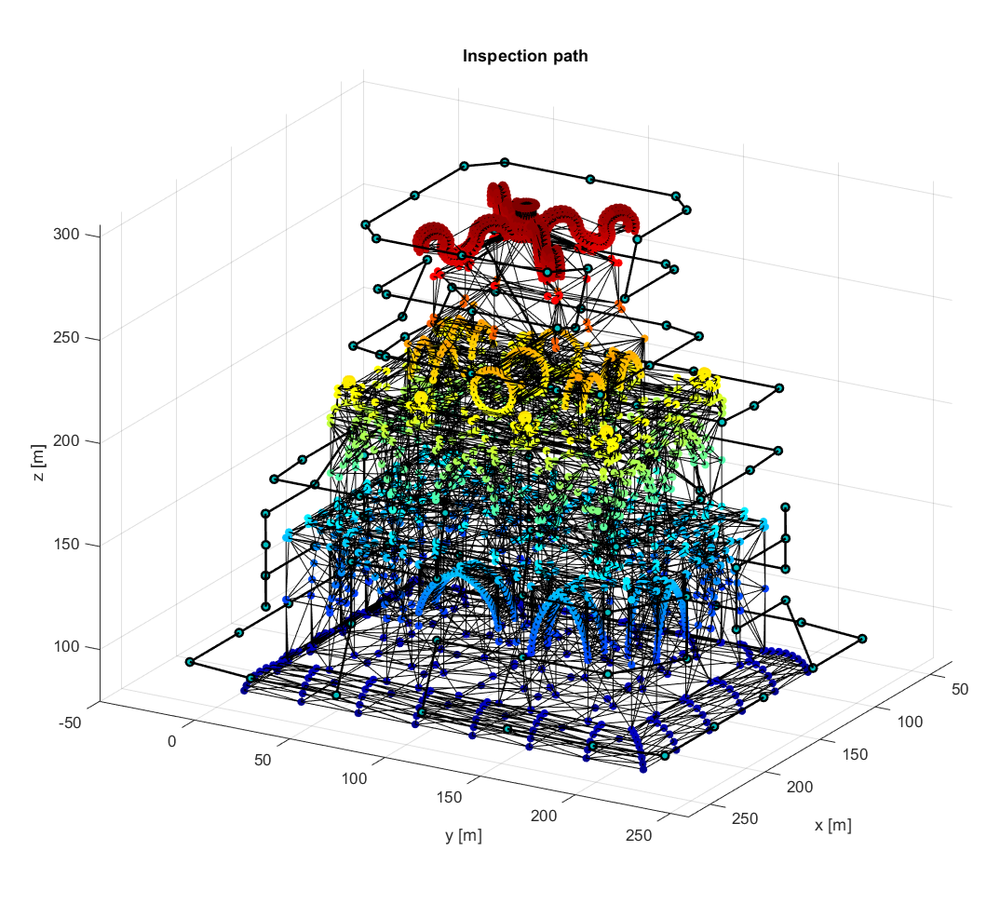
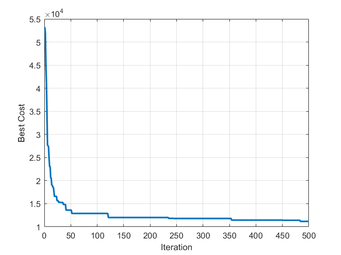

# Ant Colony Optimization for 3D Inspection Path Planning
Matlab code for 3D inspection path planning

Duy Nam Bui and Ngan Duong Thi Thuy and Manh Duong Phung, 'Ant Colony Optimization for 3D Inspection Path
Planning with Multiple Unmanned Aerial Vehicles'.

