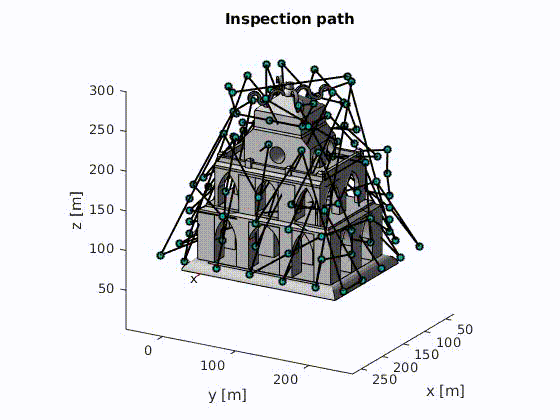

# Ant Colony Optimization for Cooperative Inspection Path Planning Using Multiple Unmanned Aerial Vehicles

This repository presents the MATLAB source code of the following article:

Duy Nam Bui and Thuy Ngan Duong and Manh Duong Phung, "**Ant Colony Optimization for 3D Inspection Path
Planning with Multiple Unmanned Aerial Vehicles**," *The 2024 16th IEEE/SICE International Symposium on System Integration (SII 2024)*, Ha Long, Vietnam, 2024, pp. 675-680. [[**IEEE** *Explore*]](https://ieeexplore.ieee.org/document/9549498)[[Citation]](#citation)

## Citation
```
@INPROCEEDINGS{10417512,
  author={Bui, Duy Nam and Duong, Thuy Ngan and Phung, Manh Duong},
  booktitle={2024 IEEE/SICE International Symposium on System Integration (SII)}, 
  title={Ant Colony Optimization for Cooperative Inspection Path Planning Using Multiple Unmanned Aerial Vehicles}, 
  year={2024},
  volume={},
  number={},
  pages={675-680},
  keywords={Solid modeling;Ant colony optimization;Visualization;Three-dimensional displays;Inspection;Autonomous aerial vehicles;Path planning;Coverage path planning;infrastructure monitoring;vision-based inspection;ant colony optimization;unmanned aerial vehicle},
  doi={10.1109/SII58957.2024.10417512}}
```

## Results
The result of algorithm with 350 iterations.
| Path | Cost value |
| :---:        |     :---:      |
|     |     |
